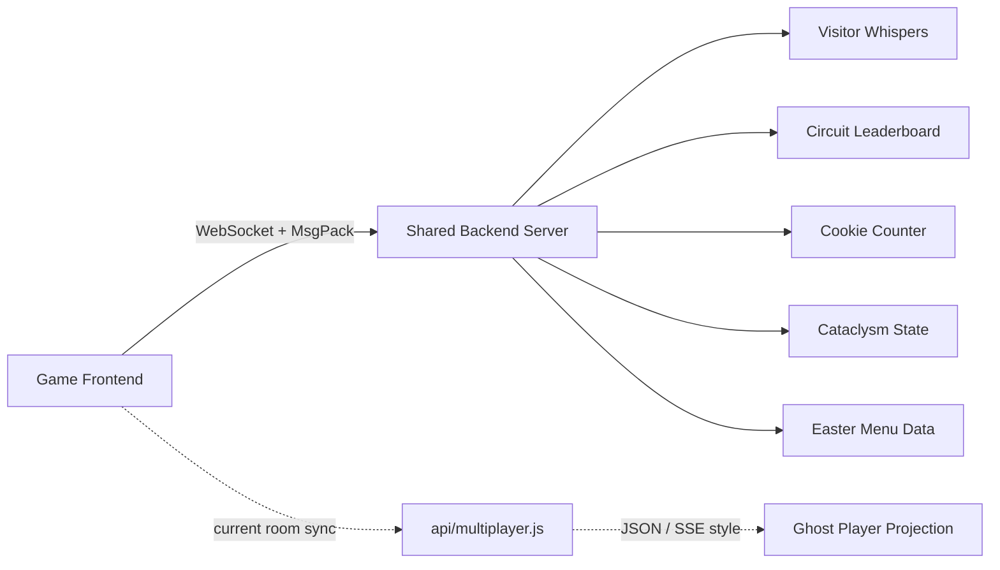
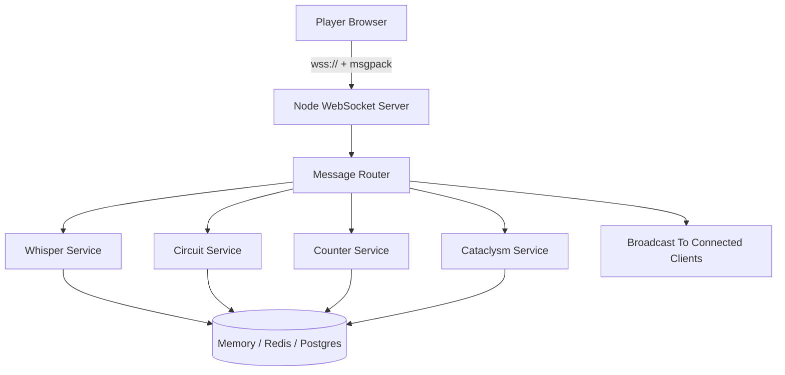

# Portfolio Shared Backend Server

<p align="center">
  <strong>Realtime backend plan for whispers, circuit scores, shared counters, cataclysm state, and future online systems.</strong>
</p>

<p align="center">
  <a href="./readme.md">README</a>
  |
  <a href="#current-state">Current State</a>
  |
  <a href="#protocol-overview">Protocol</a>
  |
  <a href="#recommended-first-build">First Build</a>
  |
  <a href="#build-phases">Build Phases</a>
  |
  <a href="#acceptance-checklist">Checklist</a>
</p>

<p align="center">
  
  
  
  
</p>

---

## Purpose

This project can run without the shared backend, but a few online/shared features stay offline until a separate server is running.

This document explains what exists now, what the backend must provide, and a practical build plan.

## Quick Summary

| Question | Answer |
| --- | --- |
| Is the backend currently included? | No. The original shared server source is not in this repo. |
| Does the main game need it? | No. Driving, areas, music, menus, and local interactions still work. |
| What does it unlock? | Whispers, circuit scores, cookie counter, cataclysm state, easter data, and online UI state. |
| What transport does the frontend expect? | WebSocket. |
| What format does it expect? | Binary `msgpack-lite` messages. |
| Is this the same as `api/multiplayer.js`? | No. That file is for the current room / ghost-player feature. |
| Where is the server URL configured? | `.env` with `VITE_SERVER_URL`. |

## Protocol Overview



## Current State

The frontend has a `Server` client wrapper in `sources/Game/Server.js`.

It does this:

- Creates a persistent visitor `uuid` in `localStorage`.
- Starts in offline mode by adding `is-server-offline` to the HTML element.
- Connects only if `VITE_SERVER_URL` is set.
- Opens a WebSocket connection to `VITE_SERVER_URL`.
- Sends and receives binary messages encoded with `msgpack-lite`.
- Marks the site online when the WebSocket connects.
- Marks the site offline again if the socket closes.

Current `.env`:

```env
VITE_SERVER_URL=
```

Because this value is empty, the frontend never attempts to connect to the shared backend. That is why the UI says the server is offline.

## Important: Existing `api/multiplayer.js`

There is already an `api/multiplayer.js` file in this repo.

That file is for the room/ghost-player multiplayer feature. It uses HTTP/SSE-style messages and JSON. It is not the same as the original shared server system used by whispers, circuit scores, cookies, and cataclysm.

Do not mix these two systems:

| System | File / Config | Purpose | Format |
| --- | --- | --- | --- |
| Room multiplayer | `api/multiplayer.js` | room presence / ghost car state | JSON |
| Shared backend | `VITE_SERVER_URL` | whispers, scores, shared counters, cataclysm, easter data | MsgPack over WebSocket |

## Why The Backend Is Separate

The original project intentionally did not include the backend source. The frontend even says this in the behind-the-scenes text:

```text
For security reasons, I'm not sharing the server code, but the portfolio works without it.
```

So this repo contains the client expectations, not the server implementation.

## Does This Backend Affect The Main Game?

Not heavily.

The main game still works without it:

- 3D world
- driving
- map
- areas
- music
- menus
- achievements that are local
- local interactions

The backend only affects shared online state:

- visitor whispers
- circuit leaderboard
- cookie counter
- altar/cataclysm progress
- tornado/cataclysm running state
- easter menu data
- online/offline UI state

If the server is offline, these features either disable submission or show empty/offline states.

## Required Transport

The frontend expects a WebSocket server.

Client code:

```js
this.socket = new WebSocket(import.meta.env.VITE_SERVER_URL)
this.socket.binaryType = 'arraybuffer'
```

The backend should accept WebSocket connections at the URL used in:

```env
VITE_SERVER_URL=wss://your-server.example.com
```

For local development:

```env
VITE_SERVER_URL=ws://localhost:8787
```

## Required Encoding

Messages are not JSON strings.

The frontend uses `msgpack-lite`:

```js
decode(data) {
    return msgpack.decode(new Uint8Array(data))
}

encode(data) {
    return msgpack.encode(data)
}
```

So the backend should:

- decode incoming binary WebSocket frames with msgpack
- encode outgoing messages with msgpack
- send binary frames back to clients

## Session Identity

The frontend automatically adds `uuid` to every outgoing message:

```js
this.socket.send(this.encode({ uuid: this.uuid, ...message }))
```

The backend should treat this `uuid` as the visitor/session ID.

Use it for:

- one whisper per user
- rate limiting
- preventing spam
- identifying repeat submissions
- optional leaderboard cooldowns

Do not treat it as secure authentication. It lives in localStorage and can be changed by a user.

## Initial Message

When a client connects, the backend should send one `init` message containing all shared state needed by the frontend.

Recommended shape:

```js
{
    type: 'init',
    whispers: [],
    circuitLeaderboard: [],
    circuitResetTime: 0,
    cookiesCount: 0,
    cataclysmCount: 0,
    cataclysmProgress: 0,
    cataclysmRunning: false,
    easterEggs: []
}
```

Fields used by the frontend:

- `whispers`: consumed by `sources/Game/World/Whispers.js`
- `circuitLeaderboard`: consumed by `sources/Game/World/Areas/CircuitArea.js`
- `circuitResetTime`: consumed by `sources/Game/World/Areas/CircuitArea.js`
- `cookiesCount`: consumed by `sources/Game/World/Areas/CookieArea.js`
- `cataclysmCount`: consumed by `sources/Game/World/Areas/AltarArea.js`
- `cataclysmProgress`: consumed by `sources/Game/World/Areas/AltarArea.js`
- `cataclysmRunning`: consumed by `sources/Game/Tornado.js`
- `easterEggs`: consumed by `sources/Game/Easter.js`

## Incoming Messages From Frontend

These are messages the backend should expect from the browser.

### `whispersInsert`

Sent when a visitor posts a whisper.

Frontend sends:

```js
{
    uuid: 'visitor-id',
    type: 'whispersInsert',
    message: 'Hello',
    countryCode: 'FJ',
    x: 12.34,
    y: 0.5,
    z: -8.9
}
```

Backend should:

- sanitize the message
- trim whitespace
- strip HTML
- enforce max length of 30 characters
- optionally strip emojis, matching frontend behavior
- enforce one active whisper per `uuid`
- keep max 30 whispers total
- remove old whispers when the limit is exceeded
- broadcast the new/updated whisper list

Suggested outgoing message:

```js
{
    type: 'whispersInsert',
    whispers: [
        {
            uuid: 'visitor-id',
            message: 'Hello',
            countryCode: 'FJ',
            x: 12.34,
            y: 0.5,
            z: -8.9,
            createdAt: 1710000000000
        }
    ]
}
```

If old whispers are removed, send:

```js
{
    type: 'whispersDelete',
    whispers: [
        {
            uuid: 'old-visitor-id'
        }
    ]
}
```

### `circuitInsert`

Sent when a player finishes the circuit and submits a score.

Frontend sends:

```js
{
    uuid: 'visitor-id',
    type: 'circuitInsert',
    countryCode: 'FJ',
    tag: 'SMG',
    duration: 73421,
    checkpointTimings: [1000, 2400, 4100]
}
```

Backend should:

- validate `tag` is exactly 3 uppercase safe characters
- validate duration is a positive number
- reject impossible/obviously fake times
- keep daily leaderboard or all-time leaderboard, depending on desired behavior
- keep top 10 or top N scores
- broadcast updated leaderboard

Expected leaderboard item format:

```js
[
    'SMG',
    'FJ',
    73421
]
```

Suggested outgoing message:

```js
{
    type: 'circuitUpdate',
    circuitLeaderboard: [
        ['SMG', 'FJ', 73421],
        ['AAA', 'US', 80120]
    ],
    circuitResetTime: 1710000000000
}
```

### `cookiesInsert`

Sent in batches when visitors collect/click cookies.

Frontend sends:

```js
{
    uuid: 'visitor-id',
    type: 'cookiesInsert',
    amount: 3
}
```

Backend should:

- validate `amount` is a reasonable positive integer
- add it to the shared `cookiesCount`
- broadcast the updated count

Outgoing:

```js
{
    type: 'cookiesUpdate',
    cookiesCount: 1234
}
```

### `cataclysmInsert`

Sent when a visitor contributes to the altar/cataclysm event.

Frontend sends:

```js
{
    uuid: 'visitor-id',
    type: 'cataclysmInsert'
}
```

Backend should:

- increment `cataclysmCount`
- update `cataclysmProgress`
- decide when `cataclysmRunning` becomes true
- broadcast the updated cataclysm state

Outgoing:

```js
{
    type: 'cataclysmUpdate',
    cataclysmCount: 42,
    cataclysmProgress: 0.42,
    cataclysmRunning: false
}
```

## Outgoing Messages To Frontend

The backend should send these message types.

### `init`

Sent once immediately after WebSocket connect.

Contains the full shared state:

```js
{
    type: 'init',
    whispers: [],
    circuitLeaderboard: [],
    circuitResetTime: 0,
    cookiesCount: 0,
    cataclysmCount: 0,
    cataclysmProgress: 0,
    cataclysmRunning: false,
    easterEggs: []
}
```

### `whispersInsert`

Sent after one or more whispers are added.

```js
{
    type: 'whispersInsert',
    whispers: []
}
```

### `whispersDelete`

Sent after one or more whispers are removed.

```js
{
    type: 'whispersDelete',
    whispers: []
}
```

### `circuitUpdate`

Sent after leaderboard changes.

```js
{
    type: 'circuitUpdate',
    circuitLeaderboard: [],
    circuitResetTime: 0
}
```

### `cookiesUpdate`

Sent after the shared cookie count changes.

```js
{
    type: 'cookiesUpdate',
    cookiesCount: 0
}
```

### `cataclysmUpdate`

Sent after cataclysm count/progress/running state changes.

```js
{
    type: 'cataclysmUpdate',
    cataclysmCount: 0,
    cataclysmProgress: 0,
    cataclysmRunning: false
}
```

### `easterUpdate`

Used by `sources/Game/Easter.js`.

```js
{
    type: 'easterUpdate',
    easterEggs: []
}
```

## Data Models

Suggested internal data shapes.

### Whisper

```js
{
    id: 'generated-id',
    uuid: 'visitor-id',
    message: 'Hello',
    countryCode: 'FJ',
    x: 12.34,
    y: 0.5,
    z: -8.9,
    createdAt: 1710000000000
}
```

### Circuit Score

```js
{
    uuid: 'visitor-id',
    tag: 'SMG',
    countryCode: 'FJ',
    duration: 73421,
    checkpointTimings: [1000, 2400, 4100],
    createdAt: 1710000000000
}
```

When sending to frontend, convert to:

```js
['SMG', 'FJ', 73421]
```

### Shared State

```js
{
    whispers: [],
    circuitLeaderboard: [],
    circuitResetTime: 0,
    cookiesCount: 0,
    cataclysmCount: 0,
    cataclysmProgress: 0,
    cataclysmRunning: false,
    easterEggs: []
}
```

## Persistence Options

| Option | Best For | Strength | Tradeoff |
| --- | --- | --- | --- |
| Memory only | local prototype | very fast to build | resets on restart |
| Redis / Upstash | counters, leaderboards, small shared state | fast and simple | less queryable than SQL |
| Postgres / Supabase / Neon | long-term records and admin tools | durable and inspectable | more schema work |

### Option A: Memory Only

Good for the first version.

Pros:

- fastest to build
- no database setup
- easiest to debug

Cons:

- data resets when server restarts
- not good if server runs multiple instances
- not good for production long-term

Use this for a proof of concept.

### Option B: Redis / Upstash

Good middle ground.

Pros:

- simple key/value storage
- good for counters, leaderboards, and small arrays
- works well with WebSocket servers

Cons:

- still needs careful data limits
- not as queryable as a full database

Use this if you want simple persistence without much database complexity.

### Option C: Postgres / Supabase / Neon

Best if you want proper long-term records.

Pros:

- durable storage
- easy admin queries
- leaderboard history
- moderation tools later

Cons:

- more schema work
- slightly more backend code

Use this if you want a polished production system.

## Hosting Notes

The shared server needs long-running WebSocket support.

Use a host that supports persistent WebSocket connections. A normal static site host is not enough by itself.

Good candidates:

- Railway
- Render
- Fly.io
- a small VPS
- any Node server host with WebSocket support

Vercel is already fine for the frontend/static portfolio and the current HTTP/SSE room API, but verify current platform limits before relying on it for the original shared WebSocket backend.

## Recommended Architecture



| Layer | Recommended Choice |
| --- | --- |
| Runtime | Node.js |
| Realtime transport | WebSocket |
| WebSocket package | `ws` |
| Message encoding | `msgpack-lite` |
| First storage | in-memory arrays/maps |
| Later storage | Redis plus Postgres |
| Deployment | Railway, Render, Fly.io, or VPS |

## Recommended First Build

Start with a small Node server:

- Node.js
- `ws` for WebSocket
- `msgpack-lite` for encoding
- in-memory arrays/maps
- one process

Suggested files:

```text
shared-server/
  package.json
  src/
    index.js
    state.js
    sanitize.js
    protocol.js
```

Suggested environment:

```env
PORT=8787
ALLOWED_ORIGINS=http://localhost:5173,https://your-site.vercel.app
```

The frontend would use:

```env
VITE_SERVER_URL=ws://localhost:8787
```

or in production:

```env
VITE_SERVER_URL=wss://your-shared-server.example.com
```

## Minimal Server Responsibilities

The backend should do these things at minimum:

1. Accept WebSocket connections.
2. Decode incoming msgpack messages.
3. Send `init` state after connect.
4. Track connected clients.
5. Handle `whispersInsert`.
6. Handle `circuitInsert`.
7. Handle `cookiesInsert`.
8. Handle `cataclysmInsert`.
9. Broadcast updates to all connected clients.
10. Enforce basic validation and rate limits.

## Validation Rules

### Whispers

- max 30 characters
- no HTML
- no empty messages
- one active whisper per `uuid`
- max 30 total whispers
- country code must be short and safe
- coordinates must be finite numbers near the map bounds

### Circuit Scores

- tag exactly 3 characters
- uppercase A-Z / 0-9 only
- duration must be positive
- duration must be within plausible min/max
- checkpoint timings must be an array of numbers
- keep top 10 or top 20 only

### Cookies

- amount must be a positive integer
- clamp amount to prevent spam
- rate limit per `uuid`

### Cataclysm

- rate limit per `uuid`
- clamp progress between 0 and 1
- define clear reset/running behavior

## Rate Limiting

Do not trust the client.

Recommended limits:

- whispers: 1 per user, or 1 update per few minutes
- circuit score: maybe 1 submit per run, plus sanity checks
- cookies: max amount per second per uuid
- cataclysm: cooldown per uuid
- connection limit per IP if possible

## Broadcast Strategy

For every update:

1. Update server state.
2. Persist if using storage.
3. Broadcast the compact update message to all connected clients.

Example:

```js
broadcast({
    type: 'cookiesUpdate',
    cookiesCount
})
```

## Failure Behavior

If server is down:

- frontend shows `Server currently offline`
- whispers cannot be posted
- circuit scores cannot be saved
- local game still works

If server reconnects:

- frontend receives `init`
- menus/counters update from server state
- online UI returns

## Security Checklist

- Validate every incoming message.
- Limit message size.
- Rate limit by IP and `uuid`.
- Do not allow HTML/script in whispers.
- Use `wss://` in production.
- Restrict allowed origins where possible.
- Log errors without exposing secrets.
- Keep storage credentials only on the backend.
- Do not put database secrets in frontend `.env`.

## Build Phases

| Phase | Goal | Storage | Result |
| --- | --- | --- | --- |
| 1 | prove the frontend protocol | memory only | online UI, whispers, scores, counters |
| 2 | survive deploys/restarts | Redis or database | durable shared state |
| 3 | production safety | database plus admin tools | moderation and reset controls |
| 4 | future multiplayer foundation | room/state service | proper shared-world systems |

### Phase 1: Memory Backend

Goal: make the offline warnings disappear and prove the frontend protocol works.

Includes:

- WebSocket connection
- msgpack encode/decode
- `init`
- whispers
- circuit leaderboard
- cookies
- cataclysm

No database.

### Phase 2: Persistence

Goal: keep data after deploy/restart.

Add:

- Redis or database
- durable leaderboard
- durable whispers
- counter persistence
- reset schedule for daily circuit board

### Phase 3: Moderation / Admin

Goal: production safety.

Add:

- delete whisper endpoint/tool
- banned words list
- IP/uuid rate limit dashboard
- score review/debug logs
- manual reset tools

### Phase 4: Multiplayer Foundation

Goal: prepare for a proper shared-world multiplayer system without mixing it into the old shared-state protocol too early.

Add:

- room state service
- fixed-rate player transform sync
- shared destructible world events
- voice chat signaling layer
- admin visibility into active rooms
- clear separation between gameplay sync and whisper/leaderboard state

## Acceptance Checklist

The backend is ready when:

- `VITE_SERVER_URL` can point to the backend
- the browser connects without showing `Server currently offline`
- the server sends a valid `init` payload after connect
- whispers can be submitted and appear for all connected clients
- only one whisper per visitor stays active
- old whispers are removed after the max count
- circuit scores update the leaderboard
- cookie counter updates for all clients
- cataclysm state updates for all clients
- bad payloads do not crash the server
- rate limits stop spammy writes
- production uses `wss://`

## What I Think

Do not build the full backend all at once.

Best path:

1. Build a tiny memory-only WebSocket server first.
2. Wire `VITE_SERVER_URL` locally.
3. Test whispers and circuit.
4. Deploy the WebSocket server to a WebSocket-friendly host.
5. Add persistence only after the protocol is confirmed.

That keeps the main portfolio safe and avoids turning a small missing backend into a huge rewrite.
