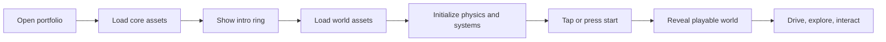

# Shiva Mani Goundar Portfolio 2026

<p align="center">
  
</p>

<p align="center">
  <strong>An interactive 3D game portfolio built with Three.js, WebGPU, Rapier physics, custom Blender assets, music, UI systems, and a drivable world.</strong>
</p>

<p align="center">
  
  
  
  
  
</p>

<p align="center">
  <a href="#features">Features</a>
  |
  <a href="#planned-features-and-upgrades">Planned Features</a>
  |
  <a href="#technology-stack">Stack</a>
  |
  <a href="#setup">Setup</a>
  |
  <a href="#backend-server">Backend</a>
  |
  <a href="./SERVER_BACKEND_SPEC.md">Server Spec</a>
</p>

---

## Overview

This is a portfolio presented as a playable 3D world. Instead of scrolling through a normal website, visitors drive around the map, discover sections, interact with areas, listen to music, unlock achievements, and explore projects through a game-like experience.

The project is based on a full Three.js world with physics, custom GLB assets, compressed textures, interactive UI, audio systems, touch/gamepad/keyboard controls, and experimental multiplayer presence.

## Features

- Drivable vehicle with physics, suspension, boost, honk, respawn, and camera controls.
- Large handcrafted 3D map exported from Blender and loaded as GLB assets.
- Interactive portfolio areas for projects, career, lab work, socials, achievements, map, whispers, and circuit racing.
- WebGPU-first rendering with WebGL fallback behavior from Three.js.
- Rapier-powered physics for vehicle movement, world interactions, objects, crates, bowling, and collisions.
- Day, night, weather, wind, rain, snow, lightning, fog, water, particles, trails, and other world effects.
- Menu system with options, controls, achievements, music, map, and behind-the-scenes information.
- Mobile, keyboard, mouse, and gamepad support.
- Landscape mobile controls with joystick and console-style action buttons.
- Experimental room-based multiplayer presence with shared ghost car projection.
- Hologram name display at the landing area.
- Loading note for first boot while the 3D world initializes.

## Planned Features And Upgrades

These are planned ideas and upgrade targets for future versions.

| Area               | Planned Upgrade                                                                                                        |
| ------------------ | ---------------------------------------------------------------------------------------------------------------------- |
| Vehicles           | Add two new playable vehicles: a jet and a mech.                                                                       |
| Combat Sandbox     | Add arcade-style guns for fun shooting, object breaking, and destruction experiments.                                  |
| Native Mobile      | Package the game as a native Android app using Capacitor and target Play Store release.                                |
| Backend Server     | Build the missing shared WebSocket backend for whispers, leaderboard scores, counters, and online events.              |
| Real Multiplayer   | Upgrade from the current ghost projection system to proper multiplayer with shared world state and player interaction. |
| Music              | Expand the music playlist into a larger catalog with more tracks and better playlist controls.                         |
| Voice Chat         | Add multiplayer audio chat with mic toggle, room voice channels, and basic mute controls.                              |
| PWA / Offline Mode | Add installable web app support with cached core assets and an offline-friendly demo mode.                             |
| Admin Tools        | Add a moderation panel for backend features like whispers, scores, multiplayer rooms, and reports.                     |

## Technology Stack

<p align="center">
  
  
  
  
  
  
</p>

| Layer                | Technology                                   |
| -------------------- | -------------------------------------------- |
| Rendering            | Three.js WebGPU renderer                     |
| Physics              | Rapier 3D                                    |
| Build Tool           | Vite                                         |
| Animation            | GSAP                                         |
| Audio                | Howler.js                                    |
| Assets               | Blender, GLB, Draco, KTX, WebP               |
| Styling              | Stylus                                       |
| Multiplayer Presence | Vercel API route with JSON/SSE-style updates |
| Shared Server Target | Separate WebSocket backend using msgpack     |

## How It Works



The portfolio loads an initial scene first, then loads the rest of the world. Once the intro is ready, the player can start driving and exploring.

## Project Structure

```text
sources/
  Game/
    Inputs/              Input systems for keyboard, pointer, gamepad, mobile, and landscape controls
    Physics/             Rapier physics and vehicle physics
    World/               World objects, areas, weather, terrain, and effects
    Server.js            Client WebSocket wrapper for the missing shared backend
  data/                  Static data such as countries and project data
  style/                 Stylus stylesheets

static/
  areas/                 Area GLB files and map-related assets
  sounds/                Music and sound effects
  ui/                    Icons, previews, flags, controls, and interface images
  vehicle/               Vehicle GLB assets

api/
  multiplayer.js         Current room/ghost multiplayer API

resources/
  *.blend                Blender source files and art resources
```

## Setup

Create a local `.env` file from `.env.example`.

```bash
npm install
npm run dev
```

Build for production:

```bash
npm run build
```

Preview production build:

```bash
npm run preview
```

## Environment Variables

```env
VITE_SERVER_URL=
VITE_MULTIPLAYER_URL=
VITE_ANALYTICS_TAG=
VITE_GAME_PUBLIC=
VITE_COMPRESSED=
VITE_DAY_CYCLE_PROGRESS=
VITE_YEAR_CYCLE_PROGRESS=
VITE_WHISPERS_COUNT=30
VITE_MUSIC=1
VITE_LOG=1
VITE_PLAYER_SPAWN=
```

Useful notes:

- `VITE_SERVER_URL` is for the missing shared WebSocket backend.
- `VITE_MULTIPLAYER_URL` is for the current room/ghost multiplayer API.
- `VITE_COMPRESSED=1` makes the game load compressed GLB/KTX assets when matching compressed files exist.
- `VITE_PLAYER_SPAWN` can be used to start at a specific respawn location.

## Backend Server

The original shared backend is not included in this repository. The frontend already contains a WebSocket client, but the actual server must be built separately.

The backend would power:

- whispers left by visitors
- circuit leaderboard scores
- shared cookie counter
- altar/cataclysm progress
- tornado/cataclysm running state
- easter shared data

Read the full backend plan here:

[SERVER_BACKEND_SPEC.md](./SERVER_BACKEND_SPEC.md)

## Multiplayer Status

The current multiplayer feature is an experimental room system. It lets players join the same room and see remote car projection/state, but it is not yet a full authoritative multiplayer game.

Planned real multiplayer would need:

- authoritative or semi-authoritative server state
- collision/interaction sync
- shared crate/object destruction
- player names and presence
- room voice chat
- better latency handling
- anti-spam and basic moderation

## Blender And Asset Workflow

The world is built from Blender and exported into GLB files under `static/`.

General workflow:

1. Edit the Blender scene.
2. Export the correct GLB asset.
3. Keep object names and custom properties stable when the code depends on them.
4. Restart the dev server or hard refresh the browser.
5. Run the compression pipeline when needed.

Compress assets:

```bash
npm run compress
```

Compression process:

- Finds GLB files in `static/`.
- Creates compressed variants while preserving originals.
- Converts model textures to GPU-friendly formats.
- Converts UI images to WebP where applicable.

## Controls

| Device           | Controls                                                             |
| ---------------- | -------------------------------------------------------------------- |
| Keyboard         | WASD or arrows, Shift boost, Space jump, H honk, R respawn, C camera |
| Mouse            | Drag to move camera, click/tap interactive points                    |
| Mobile Portrait  | Touch driving and tap controls                                       |
| Mobile Landscape | Joystick plus action buttons                                         |
| Gamepad          | Driving, boost, brake, jump, camera, and interact support            |

## Development Notes

- Keep generated/compressed assets separate from source Blender files.
- If an edited GLB causes startup errors, check object names and custom properties first.
- Some online UI will show offline until `VITE_SERVER_URL` points to a real WebSocket backend.
- The project is graphics-heavy, so first load can pause briefly while the browser initializes the 3D world.

## License

This project is based on the public portfolio source and is intended as a personal creative portfolio project.

Check `LICENSE` for repository license details.
